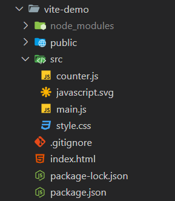
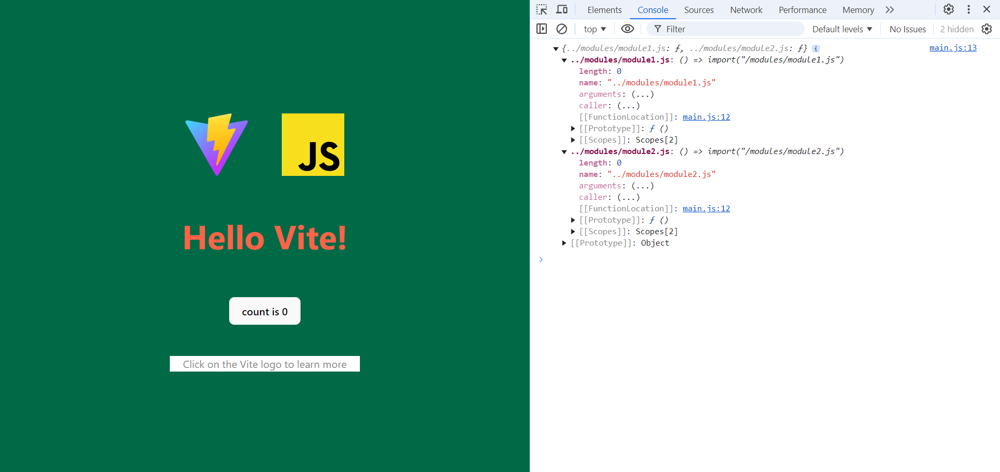

# Curso de Vite.js

## Índice
* [Clase 01 - ¿Qué es Vite?](#id1)
* [Clase 02 - Historia del Ecosistema de JavaScript](#id2)
* [Clase 03 - Características de Vite](#id3)
* [Clase 04 - ¿Cómo instalar Vite?](#id4)
* [Clase 05 - Boilerplate de Vite](#id5)
* [Clase 06 - Importar CSS](#id6) 
* [Clase 07 - Pre-procesadores CSS](#id7)
* [Clase 08 - CSS Modules](#id8)
* [Clase 09 - Importar imágenes](#id9)
* [Clase 10 - Importar JSON](#id10)
* [Clase 11 - Importación global](#id11)
* [Clase 12 - Uso con TypeScript](#id12)
* [Clase 13 - Vite Config](#id13)
* [Clase 14 - Variables de entorno y modos](#id14)
* [Clase 15 - Sitios multi-página](#id15)
* [Clase 16 - Construir librerías](#id16)
* [Clase 17 - Soporte para React](#id17)
* [Clase 18 - Soporte para Vue](#id18)

## ¿Qué es Vite? [1/19]<a name="id1"></a>
Vite es una herramienta de **tercera generación** para el desarrollo de frontend, la cual recolecta todas las tecnologías que se utilizan en el estándar de desarrollo web moderno, como por ejemplo webpack, create-react-app, etc.

### Ventajas de Vite
Vite nos va a permitir tener una mejor experiencia de desarrollo y nos aporta todas las funcionalidades que traen estas tecnologías, pero con características nuevas:
* Más fácil de usar y aprender a usar.
* Necesita menos configuración.
* Mucho más veloz, compila y transpila más rápido.
* Automatización de recargar el navegador cuando hacemos cambios
* Trae una serie de optimizaciones por debajo que nos permitirá que nuestros proyectos queden mucho mejor estructurados, sin necesidad de una configuración complicada.

> [!TIP]
> El nombre Vite se pronuncia **BIT** y no **BAIT** porque viene del francés y no del inglés.

> [!IMPORTANT]
> Vite es una herramienta de desarrollo frontend de tercera generación.

## Historia del Ecosistema de JavaScript [2/19]<a name="id2"></a>
Cuando la web comenzó únicamente eran páginas de texto con algunas imágenes y enlaces.

Posteriormente, se implementó CSS para agregar estilos con el fin de organizar los elementos y estilizar los elementos.

Con el tiempo fue necesario agregar nuevas características a los sitios con JavaScript
* JavaScript dio un cierto dinamismo a la web

Conforme iba a creciendo el código fue necesario llegar al tema de implementar módulos y librerías de JS para organizar de mejor manera el código
Inicialmente, solo existía esta forma, que era usar una etiqueta de HTML donde se referenciaba al archivo o dentro de la etiqueta:
````html
<script src="modulo.js"></script>
````
Esta era la forma más básica de hacer un módulo, cargando el archivo y ya estaba listo para usarse.
Pero con el tiempo de igual manera fue creciendo donde ya no se tenía un solo script sino una serie de etiquetas:
```html
<script src="modulo1.js"></script>
<script src="modulo2.js"></script>
<script src="modulo3.js"></script>
```
El gran problema era que no se tenía ningún estándar para cumplir con este objetivo
Al implementar esta manera se tenía unas reglas como ser:
* Al necesitar algo de un módulo primero se debe cargar para que otros módulos lo implementen

Esto causaba problemas a la experiencia de desarrollo
* Difícil de leer.
* Se podían producir muchos errores en caso de no importar los archivos en el orden correcto.
* Había probabilidades de una colisión entre variables, sobre escribiendo valores en cada archivo.

Por este motivo se buscó soluciones para este problema, de esta manera surgió IIFE.

### IIFE
Debido a los problemas anteriores, surgieron las IIFE *(Expresión de función ejecutada inmediatamente)*.
Lo que aportaba esta solución era que las variables se quedaban en el contexto de la función, evitando la colisión de variables.
Se crea una función normal en JavaScript envuelta en unos paréntesis, para que en el momento en que se declara también se ejecutara. A la hora de usarla se veía de la siguiente forma y esto hacía que las variables se quedaran dentro del módulo, evitando la colisión de variables.
```javascript
var module = (function(){
	var version = "1.0.0";
})():

// en este punto, version es inaccesible
var module = (function(){
	var version = "2.0.0";
	return { version };
})():

// Salida inmediata:
module.version;  // "1.0.0"
```

### Minificación
Conforme fue avanzando el desarrollo web surgieron conceptos como minificación.
El proceso de minificacion surgió debido a la cantidad de código que se necesita para hacer web, este consiste en un tipo de compresión donde se eliminan características del código que el navegador no necesitaba y solo estaban ahí para una mejor legibilidad, por ejemplo, los espacios.
La minificacion ayudaba a la performance de la web en archivos grandes, este es él antes y después de un código minificado:
```javascript
// Sin minificar
var data = {
	name: "Diana",
	age: 27
};

// Minificado
var data={name:"Diana",age:27};
```

> [!IMPORTANT]
> El proceso de **minificación** es en el que se elimina el contenido innecesario como espacios y comentarios, para hacer paquetes mas ligeros en producción.

### Bundling
A veces tienes muchos módulos dentro de un mismo sitio web y muchos de estos los consumes al mismo tiempo. Aquí es donde entra el bundling, un proceso donde se toman todos estos módulos y se convierten en un solo archivo minificado y listo para utilizar.
Su ventaja esta en que cuando el usuario ingresa al sitio, solo descargue un archivo de configuración una sola vez, mejorando el performance.

> [!IMPORTANT]
> El proceso de **bundling** es en el que se optimiza el código en paquetes para producción, eliminando el código innecesario y separando o juntando los módulos necesarios.

### Node.js
Trae toda una revolución, permitiendo a las personas usar JavaScript del lado del backend para modificar la forma en la que se comportan las páginas web.
Con el diseño de Node.js llegaron las herramientas de primera generación:
* Templates: Un template o plantilla es cuando tomamos diferentes bloques de HTML, hacer que se junten y crear una página completa (Jade, Pug).
* Posteriormente, se implementó con CSS (Sass, Stylus) los cuales ayudaron a escribir código de estilos más fácilmente.

### Herramientas para la automatización
Comienzan a surgir la necesidad de herramientas para automatizar estos procesos y se encarguen del orden de ejecutarlos, como por ejemplo **Grunt o Gulp** donde era necesario escribir scripts para automatizar este proceso.
También surgen herramientas para generar código como ser yeoman generator.

### Yeoman Generator
Herramienta que permite generar código por medio de comandos, por ejemplo generar un componente con todo el código base a través de un solo comando.
Esto acelero el proceso de desarrollo y teniendo que mantener más herramientas.

### Frameworks
Comienzan a salir los primeros frameworks (Angular.js, Ember.js, Backbone.js)
* El framework proveía una estructura para trabajar.
* Se empieza a tener la necesidad de tener muchas carpetas con múltiples archivos, estructurados de una cierta manera, los cuales se transpilaban para producción.
* Nace el concepto de **transpilacion**, es decir, encontrarse en una etapa de desarrollo y luego generar una versión para producción.

### ES6+
En su momento aparece ECMAScript 6 y con ello Babel.
* En primer orden, se utilizaba en desarrollo ES6 y posteriormente se usaba Babel.js para llevar el código moderno en una versión anterior para que todos los navegadores pudieran ejecutarlo sin ningún problema.
* De esta forma se tenían las últimas características de la web en navegadores modernos y tener retro compatibilidad en navegadores antiguos.
Posteriormente, comienzan a aparecer las herramientas de segunda generación (React, Angular 2, Eslint, Prettier, etc.)
Con ello aparece Webpack

### Webpack
Una de las herramientas que más se emplea hoy en día, la cual permite hacer todos estos procesos que hemos estado viendo a lo largo de esta clase.
Mediante una configuración se pasaban los distintos archivos de desarrollo a código de producción
Pero no todo era perfecto, entre las mayores desventajas de webpack están:
* Lento
* Necesita bastante configuración

Por ello surgen alternativas de la comunidad
* Esbuild ⇒ es un bundler bastante rápido escrito en Go.
* Parcel ⇒ Se enfoca en tener poca configuración.
* Rollup ⇒ Se enfoca en poder generar una versión para producción bastante especializada cumpliendo estándares de la web.

### TypeScript
Es un lenguaje de programación tipado que se transpila hacia JavaScript bastante útil, pero esto conlleva reescribir todo el ecosistema para que sea compatible con JavaScript, convirtiéndose en otra razón para hacer un cambio en la web.

### Tercera generacion de herramientas
De esta manera llegamos a Vite.js
Su objetivo es mejorar la experiencia de desarrollo teniendo una mejor velocidad y menor configuración.

## Características de Vite [3/19]<a name="id3"></a>
En esta clase vamos a ver las principales características de Vite.
Destaca la reinvención de muchos procesos, como la resolución de dependencias, la implementación con TypeScript, el HMR, entre muchas otras funcionalidades.

### Optimización de código
Vite optimiza muchos de los procesos por los que tiene que pasar el código, de ese modo se enfoca en un mejor rendimiento y experiencia de desarrollo.

### Pre-bundling
Es la etapa donde se estandarizan los módulos.
Adapta los módulos en CommonJS o UMD y los pasa al formato estándar de ECMAScript.
*Los módulos por muchos años NO estuvieron estandarizados hasta que apareció el estándar de ECMAScript con los ES Modules.*

> [!IMPORTANT]
> El proceso de **pre-bundling** agrega compatibilidad, pues adapta módulos en CommonJS o UMD, al formato estándar de ECMAScript, los ES modules.

### Dependency resolving
Vite optimiza el proceso en que se obtienen librerías y módulos estandarizados.
Lo primero que hace Vite.js es generar un **servidor de archivos estático**, es decir, que va a tomar todos los archivos del proyecto y los va a hacer disponibles para acceder desde el navegador, de esta manera va a reemplazar los **imports** vía node.js por **imports URL**.
También se asegura de servir los archivos de forma inteligente y con caché, para optimizar tiempo y procesamiento, esto lo hace subdividiendo las dependencias y ordenando las importaciones para que todo esté listo para el momento de uso, utilizando un caché fuerte, el cual se asegura que los archivos se queden en el navegador a menos que se limpie la caché del mismo

> [!IMPORTANT]
> La **resolución de dependencias** en vite funciona exponiendo todo como un servidor de archivos estáticos y aprovecha el cache del navegador para ganar performance.

### Hot module replacement (HMR)
El HMR es cuando se hace **un cambio en el código y este se ve reflejado en el navegador casi de forma inmediata**, sin perder el estado de la aplicación y sin tener que recargar el navegador. Esto nos otorga una mejor experiencia de desarrollo al ser más rápido.

> [!IMPORTANT]
> El **HMR** o Hot Module Replacement, es la estrategia que permite visualizar los cambios del código en tiempo real en el navegador, manteniendo el estado.

### Importación de archivos
Nos otorgará una importación de archivos simplificada. 
*(Resuelve la importación sin necesidad de loaders.)* 
Es simple de usar con archivos multimedia, estilos, código o con los preprocesadores más comunes, incluyendo TypeScript.

### Integración simple con TypeScript
Desde el primer momento, un proyecto con Vite tiene integración con TypeScript sin necesidad de alguna configuración adicional.
Es opcional la configuración de TypeScript.
Es totalmente utilizable con cualquier librería o framework.

### Integración con frameworks
Soporte perfecto con Vue.js
Vite es desarrollado por el equipo de Vue.js por lo cual la integración es simple y completa.
Útil para usar JSX con Vue.js
Hace que sea extremadamente simple usar Vite con React.js

### Optimización para producción
Proporciona una serie de optimizaciones a la hora de transpilar para producción o también conocido como **build**.
Permite tomar el control de la configuración. Se podrá utilizar la configuración por defecto tanto en desarrollo como en producción, o bien, se podrá tener una configuración más específica y controlada por el desarrollador.
La velocidad en desarrollo aumenta gracias a esbuild.
Optimiza el bundle de producción gracias a Rollup. La importación de dependencias se hace de modo inteligente, es decir, resuelve los módulos a emplear en el proyecto y predice hasta cierto punto los módulos que van a seguir, para importarlos desde un inicio.

### Soporte a Web Workers y Web Assembly
Los Web Workers son una característica de JavaScript que permiten crear procesos alternativos al proceso principal. Implementarlos puede llegar a tener una configuración complicada, pero con Vite no, teniendo la posibilidad de importarlos de una manera específica y estar listos para ser usados.
Aunque también existe la posibilidad de importar un archivo Web Assembly e invocarlo donde queramos que se ejecute.

## ¿Cómo instalar Vite? [4/19]<a name="id4"></a>
Para comenzar a usar Vite.js vamos a ir a su documentación oficial https://vite.dev/ donde se podrá encontrar los beneficios que tiene, plugins, el repositorio público, las configuraciones disponibles, entre muchos más recursos que pueden ser útiles a la hora de querer profundizar los temas.

### Creando un proyecto con Vite
Se pueden generar diferentes proyectos con Vite a partir de una plantilla que bien puede ser de las siguientes tecnologías:


> [!NOTE]
> Antes de crear nuestro proyecto con Vite asegúrate de tener como mínimo instalado Node.js 14 o una versión superior y npm.

> [!IMPORTANT]
> Con Vite se pueden crear proyectos de frontend con cualquier framework compatible y librerías de componentes, etc.

### Comandos para generar un proyecto
El comando para generar un proyecto con Vite es uno de los siguientes y dependerá del *gestor de paquetes* que utilices.

> [!TIP]
> **Con NPM**: npm create vite@latest
> **Con Yarn**: yarn create vite
> **Con PNPM**: pnpm create vite

Además, existen plantillas desarrolladas por la comunidad que se pueden utilizar directamente en un proyecto.

Con npm 6.x
```
npm create vite@latest my-vue-app --template vue
```
Con npm 7.x
```
npm create vite@latest my-vue-app -- --template vue 
```
Con Yarn
```
yarn create vite my-vue-app --template vue 
```
Con pnpm
```
pnpm create vite my-vue-app -- --template vue 
```

### Configuración básica
Primero, tenemos que ir al editor de código de tu preferencia, en este caso emplearemos Visual Studio Code.
Abrir la terminal, copia y pegar uno de los comandos antes vistos en el punto anterior.

Pero antes, una muy buena recomendación es revisar las versiones de node y npm instalados en mi computador utilizando los siguientes comandos:
> [!NOTE]
> node -v 
> 20.18.0
> npm -v
> 10.8.2

Y como punto de comparación, se agregan las versiones que el profesor utilizara en este curso:
> [!NOTE]
> node -v 
> 16.13.2
> npm -v
> 8.1.2

Ahora comienza el desarrollo del curso, lo primero sera crear el proyecto, en la consola escribir el comando:
```
npm create vite@latest
```

Una vez empleado este comando, aparecerá una serie de opciones:
1. **Project name**: Lo primero que preguntara es ¿cuál va a ser el nombre del proyecto?. *En mi caso el nombre sera vite-demo*.
2. **Select a framework**: Después nos preguntará ¿que tipo de proyecto vamos a generar? (vanilla, vue, react, svelte, entre otras). *En mi caso escogeré vanilla*.
3. **Select a variant**: A continuación nos pregunta ¿que variante queremos?, es decir, si lo queremos con solo JavaScript o TypeScript. *En mi caso escogeré JavaScript*.

Se generan las carpetas y archivos por defecto.
Desde la terminal, entrar a la nueva carpeta:
```
cd vite-demo
```

### Iniciando nuestro proyecto
Ahora que el proyecto fue creado, se deben instalar los paquetes y dependencias necesarias para levantar el programa, se debe escribir el comando:
```
npm install
```
Una vez instaladas las dependencias, se puede inicializar y levantar el proyecto con el comando:
```
npm run dev
```
En la consola debería aparecer un mensaje como:
```
VITE v6.0.1  ready in 231 ms
  ➜  Local:   http://localhost:5173/
  ➜  Network: use --host to expose
  ➜  press h + enter to show help
```

## Boilerplate de Vite [5/19]<a name="id5"></a>
Una vez iniciado un proyecto con una plantilla de Vite tendrás a tu disposición una estructura básica de archivos, que nos facilitara iniciar con el desarrollo. Cada plantilla tiene su propia estructura, y por suerte todo funciona de una manera similar.

### Archivos básicos de una plantilla de Vite
Un boilerplate de Vite utilizando la plantilla para vanilla JavaScript contiene los siguientes tipos de archivo.



### Punto de entrada
Ya que Vite es una herramienta pensada para el frontend, el punto de entrada de nuestra aplicación es él archivo **index.html**. *(Aunque si lo deseas puedes cambiarlo a través de la configuración de Vite).* 
Este archivo siempre se encontrara en la raíz del proyecto.
> [!TIP]
> Si se desea cambiar el idioma de la pagina web de ingles a español, se puede hacer editando el archivo index.html que esta en la carpeta raiz.

### Archivos JavaScript
Dentro de la carpeta *src* se encuentra el archivo **main.js**, el cual tiene como principal funcionalidad darle la lógica a nuestra página. 
Además, existe un archivo **counter.js**, donde se exporta una función utilizada en **main.js** para aumentar el contador de la página.

### Estilos de nuestro proyecto
El archivo **style.css** contiene todos los estilos de la página. Más adelante, cuando ejecutes el proyecto en el navegador y veamos el tema de la carpeta dist, se podra ver que Vite convertirá este y en general muchos de los archivos, en un paquete de ECMAScript module, para poder utilizarlo de manera universal en todos los navegadores.

### Imágenes SVG
Podremos encontrar archivos .svg como vite.svg o javascript.svg, los cuales son imágenes para la página, no son necesarias para el funcionamiento de la aplicación y pueden ser cambiadas o eliminadas en un futuro.

### Scripts
Si seguimos revisando los archivos, en la carpeta raiz encontraremos el archivo **package.json**, en donde podremos encontrar el nombre de nuestra aplicación, la versión, las dependencias y los siguientes scripts que se generaron automaticamente:
* **dev**: Inicializa el servidor.
* **build**: Genera nuestro proyecto para producción y lo almacenara en la carpeta dist que se creara automaticamente.
* **preview**: Una vez tenemos nuestro proyecto para producción se ejecuta este comando, el cual toma lo que está en la carpeta dist y lo muestra en un servidor.

## Importar CSS [6/19]<a name="id6"></a>
Importar archivos con Vite es muy simple, por ejemplo para los archivos de estilos solo debemos de usar la palabra **@import** y a continuación la ruta del archivo dentro de comillas. 
Para los archivos en JavaScript sería muy parecido, solo que se remplaza **@import** por **import**.

> [!IMPORTANT]
> Para importar archivos de CSS en Vite, con **@import** en archivos de estilos, y con **import** en archivos de código.

### Manejo de estilos en Vite
Se crea un nuevo archivo de estilos llamado **base.css**.
Dentro, se agrega la siguiente regla CSS:
```css
body { 
    background-color: #006a47; 
}
```

### Importando estilos
Si levantamos el proyecto veremos que el fondo de la pagina sigue siendo blanco, esto es porque aun nos falta importar que creamos.
Debemos de importar el archivo **base.css** dentro de **style.css**.
```css
@import './base.css';
```
Si el código CSS fue agregado correctamente, ahora el color de fondo de la pagina web sera verde.
> [!TIP]
> Importante, se debe utilizar *@import* y a continuación la ruta de los estilos.

### Analizando los estilos
Si abrimos las **herramientas de desarrollo** en el navegador y nos dirigimos a la pestaña de **network** encontraremos algo bien curioso, como puedes ver se cargó más de un style.css, esto es porque una vez se guardan los cambios, los archivos que cambiaron son nuevamente solicitados.


Ahora, en la pestaña de **sources** también abra más de un style.css, porque cada cambio que se hace en un archivo creara una copia y la almacenara en caché, para que esté disponible de un modo más rápido.

Si se desea eliminar estas copias se puede reiniciar el navegador o ir a la pestaña **application**, oprimir el botón *clear site data*, reiniciar la página y ver como se trae la última versión de tu código.


### Optimizaciones de Vite
Si vamos al último archivo **style.css** en el navegador, veremos que contiene el código hecho en base.css, esto sucede porque Vite une archivos suficientemente pequeños con otros, para tratarlos como solo uno. Si los archivos son demasiado grandes, va a tratarlos por separado.

> [!IMPORTANT]
> La tecnología que utiliza Vite para el procesamiento de CSS es PostCSS, que da soporte para la optimización en producción, y también para usar pre-procesadores.

## Pre-procesadores CSS [7/19]<a name="id7"></a>
Utilizar preprocesadores de CSS, como por ejemplo **Sass** o **Less**, en Vite, es demasiado fácil, literalmente no tenemos que hacer nada para empezar a usar estas tecnologías.

### Empleando preprocesadores CSS en Vite
Para emplear preprocesadores CSS **no se debe hacer ninguna configuración o instalar ninguna dependencia**.
Vite ya integra estas tecnologías, se encarga de reconocerlas y procesarlas.

### Ejemplo Sass
Se crea un nuevo archivo que tendrá el nombre **ejemplo.sass**. 
A dicho archivo se le agregan las siguientes reglas CSS:
```css
h1 { 
	color: red; 
}
```

Para que los cambios se apliquen, se debe importar el nuevo archivo .sass directamente a los estilos principales en el archivo **styles.css**.
```css
@import './ejemplo.sass';
```
Si se guardan los cambios y el servidor de desarrollo esta levantado, se produce un error, esto se debe a que *sass* no esta instalado, por lo que se debe abrir la consola del proyecto y ejecutar el siguiente comando:
```
npm install -D sass
```
> [!TIP]
> Si en el navegador aun sigue apareciendo error, se puede cambiar la extension del archivo **.sass** por **.scss**

Una vez que se guarden los cambios y se levante el servidor,  se vera como el título de la página cambia a color rojo.

### Ejemplo less
Se crea un nuevo archivo que tendrá el nombre **demo.less**.
A dicho archivo se le agregan las siguientes reglas CSS:
```css
p {
	background-color: white;
}
```
Nuevamente, se importa el archivo en los estilos principales en el archivo **styles.css**.
```css
@import './demo.less';.
```
Si se guardan los cambios y el servidor de desarrollo esta levantado, se produce el mismo error de anterior, esto se debe a que *less* no esta instalado, por lo que se debe abrir la consola del proyecto y ejecutar el siguiente comando:
```
npm install -D less
```

Si el código se cargo de forma correcta, los textos tendrán un fondo de color blanco.


## CSS Modules [8/19]<a name="id8"></a>
Los CSS modules son una tecnología para organizar nuestro código en CSS por medio de módulos, algo muy similar a como trabajamos con las librerías de JavaScript.

### Uso de CSS modules en Vite
Antes de comenzar a crear los módulos CSS, lo primero sera editar el archivo **main.js** para agregar una etiqueta de botón, esta etiqueta deberá tener un id único.
```html
<button id="btn" type="button">Haz click aquí</button>
```
El siguiente paso sera crear un nuevo archivo con la extension *.module.css*, es lo único que necesita Vite para poder crear un modulo.
Se crea un nuevo archivo en la carpeta src llamado:  **button.module.css**.
Dentro de este archivo vamos a generar unos estilos para el botón creado anteriormente:
```css
.btn {
    border: 1px solid black;
    padding: 8px 16px;
    background-color: violet;
    text-transform: uppercase;
}

.btn:hover {
    background-color: orange;
}
```
### Importación de CSS modules en Vite
Una vez generado el archivo y las reglas CSS, faltaría importarlo dentro del archivo **main.js**, pero a diferencia de los preprocesadores, se debe importan como un módulo:
```javascript
// N_8.1: Se importa el archivo con el css module y se le agrega un nombre único para identificarlo.
import buttonStyle from './button.module.css';

// N_8.2: Para hacer una prueba si se importo correctamente el archivo, se puede utilizar un console.log. 
// En la consola aparecerá el botón como un objeto. 
// Dentro de btn aparecerá una cadena de texto, esto representa una clase en CSS.
console.log(buttonStyle);

// N_8.3: Finalmente, se puede agregar la nueva clase al botón utilizando las propiedades de javascript.
document.getElementById('btn').className = buttonStyle.btn;
```

Cuando se guarden los cambios, el botón tendrá los estilos que indicados en el módulo.


Esta es una manera estándar que nos ofrece CSS para separar nuestro código y que los estilos sean únicos hacia el componente que lo estamos importando.

## Importar imágenes [9/19]<a name="id9"></a>
Importar una imagen o cualquier archivo multimedia con Vite es bastante sencillo, simplemente debes de usar la palabra clave import, definir un nombre para la imagen e indicar donde se encuentra.
Se agrega una imagen dentro de la carpeta src.
Luego se edita el archivo **main.js** para realizar la importación de la imagen.
```javascript
// N_9.5: Se importan los estilos CSS propios de la imagen.
import imageStyle from './image.module.css';

// N_9.1: Se importa la imagen desde la carpeta raíz.
import img from './gatito.jpg';

// N_9.2: Se crea una etiqueta dentro de la plantilla #app y se le asigna un id único que pronto utilizaremos.


// N_9.3: Se crea una constante para poder asignar la etiqueta de tenga el id "my-img".
const imagen = document.getElementById('my-img')
// N_9.4: Utilizando las propiedades de JavaScript se asigna la imagen a la etiqueta y posteriormente, se le asigna su clase css.
imagen.src = img;
imagen.className = imageStyle.img
```
El resultado debería ser algo asi:


### ¿Cómo está pasando?
Al abrir las herramientas de desarrollo, en la pestaña de sources, podremos encontrar dos archivos.
* Nuestra imagen
* Un archivo de JavaScript con el nombre de la imagen y adicionalmente la palabra ?import.


Este último es un ECMAScript module que contiene nuestra imagen. Vite convierte todo a un ECMAScript module para un mejor rendimiento.

## Importar JSON [10/19]<a name="id10"></a>
Con Vite podemos importar todo el contenido de un archivo JSON de una manera muy simple, aunque también podemos traer partes específicas para optimizar el código y mejorar el rendimiento en producción.

### Importar JSON
Para comenzar, se crea un nuevo archivo JSON que se llamara **data.json** y contendrá la siguiente información:
```
{
	"user": {
		"name": "Felipe",
		"lastname": "Muñoz"
	},
	"session": {
		"id": "string session" 
	}
}
```
Una propiedad de usuario que tendrá su nombre y apellido.
Una propiedad de sesión como si se tratara de una pagina web.

A continuación, para importar el archivo JSON lo haríamos igual que como lo hemos hecho en clases anteriores. Se debe importar dentro del archivo **main.js**:
```javascript
import data from "./data.json";
```
Dentro del selector "#app" se agrega una etiqueta < pre > para poder visualizar la información del json.
Se utiliza la función **JSON.stringify()** para pasar la data y traer todo el objeto json directamente a la etiqueta.
```javascript
<pre>${JSON.stringify(data)}</pre>
```

### Import especifico
Con el método anterior estamos importando todo el archivo, lo que lo vuelve mas pesado y lento, pero podemos hacer un ajuste para visualizar partes específicas destructurando el objeto.
Si solo se quiere traer una parte especifica del JSON, por ejemplo el user, se agrega a la petición utilizando un punto de separación.
```javascript
<pre>${JSON.stringify(data.user)}</pre>
```


> [!IMPORTANT]
> Es bueno utilizar la desestructuración al importar JSON porque permite optimizar el build para producción, al eliminar todo el código innecesario.

### Enviar el proyecto a producción
Con los cambios y pruebas que hemos realizados hasta ahora, se realiza una prueba enviando el proyecto a producción. Para esto se debe ejecutar el comando:
```
npm run build
```
Se genera automáticamente la carpeta **dist**. Dentro, los archivos tendrán un nombre compuesto por el nombre original del archivo, seguido de un hash (serie de números y letras).


Dentro del archivo mainxxxxx.js revisar como queda el código al cargar el json y la diferencia entre ambas opciones.

## Importación global [11/19]<a name="id11"></a>
La importación global nos permite importar archivos de forma masiva, es decir, poder tomar toda una carpeta e importarla de una sola vez para usarla dentro del código.

> [!IMPORTANT]
> La ventaja de la importación global es que podemos importar archivos de forma masiva utilizando JavaScript, para no tener que importar cada elemento nuevamente.

### Creando los módulos
Primero, se deben crear los archivos que queremos importar. 
En este ejemplo se creara una carpeta con el nombre **modules** y dentro se agregaran dos archivos, **module1.js** y **module2.js**.

### module1.js
Se crea una función, cuando el modulo este cargado se mostrara un mensaje con el nombre del modulo.
Ademas, se exporta el modulo para poder utilizarlo dentro de otros archivos.
```javascript
const module = {
	name: "modulo 1"
}

export function load() {
	console.log(`${module.name} cargado!`)
}

export default module
```

### module2.js
Se copia y pega el código del modulo anterior, solo se cambia el nombre.
Ademas, se escriben los mensajes ingles, para dejar una diferencia visible.
```javascript
const module = {
    name: "module 2"
}

export function load() {
    console.log(`${module.name} load!`)
}

export default module
```

### Global import
Ahora que se han creado los archivos de ejemplo, se deben importar, para esto se crea una constante, a la cual se le asigna la ruta utilizando las propiedades *meta.glob()*.
Dentro la ruta se utiliza el comodín de asterisco que indica todos los archivos que tengan la extension *.js* se guardaran en la constante.
```javascript
const modules = import.meta.glob('../modules/*.js')
```

### Usando nuestros módulos
Se utiliza la consola para realizar una prueba para ver que esta retornando la constante modules.
Si la ruta esta correcta, debería leerse como un json que contiene los diferentes módulos.
```javascript
console.log(modules);
```
Si imprimimos modules veremos que estamos importando un JSON que contiene los diferentes módulos, es por esto que podemos iterarlo con un for In y ejecutar las funciones load que tiene cada archivo.



Ya que la ruta de los módulos esta correcta:
1. Se crea un *for In* el cual recorrerá la lista de módulos: *for (const path in modules) {}*
2. Después con la llave o key de la iteración *(path)* se accede a cada uno de los módulos que están en *modules*, como esto es una función deberemos ejecutarla agregando los paréntesis.
3. Al ejecutarla nos estará devolviendo una promesa, por lo que podremos emplear *.then()* para acceder al *module*.
4. Dentro de *.then()* se utiliza una *función flecha* que tome el módulo actual y ejecute la función *load()* de cada archivo de módulo.
```javascript
for (const path in modules) {
	modules[path]()
	.then((module) => {
		module.load()
	})
}
```

Si el código se escribió de forma correcta, en la consola del navegador se deberían ver los mensajes escritos en cada modulo.


## Uso con TypeScript [12/19]<a name="id12"></a>
Ahora vamos a ver como Vite detecta y procesa los archivos de TypeScript sin la necesidad de tener que hacer una configuración complicada, aunque si nosotros lo deseamos podemos cambiar esa configuración por defecto y que TypeScript se comporte como nosotros queramos.

> [!IMPORTANT]
> Muy a menudo surge la pregunta, ¿Cuál es el plugin de Vite para utilizar TypeScript?, y la respuesta es simple, **Ninguno** ya que Vite soporta TypeScript sin configuración adicional.

### Usando TypeScript con Vite
Para comenzar a utilizar TypeScript en este proyecto literalmente no tenemos que hacer nada. 
Se crea un nuevo archivo que se llamara **suma.ts**, dentro se crea una función para sumar dos valores.
Se utiliza el sistema de tipos de typescript para definir que tipo de dato tendrá cada variable, asi como el valor del retorno.

```javascript
export default function suma(a: number, b: number): number {
    return a + b
}
```

Ahora dentro del archivo **main.js** se puede importar la nueva función y Vite detectara automáticamente que es un archivo de TypeScript, además se encargara de procesarlo. 
Se utiliza la consola para ejecutar la función, se le pasan 2 parámetros y si el archivo se importo correctamente, la consola mostrara el resultado de la suma.
```javascript
import suma from './suma.ts';

console.log(`suma 2+3 = ${suma(2, 3)}`);
```


### Configuración personalizada de TS
Si queremos cambiar la configuración por defecto de Vite para utilizar TypeScript con una configuración propia.
Se crea un nuevo archivo en la carpeta raíz llamado **tsconfig.json**.
Dentro de este archivo se agrega una configuración de ejemplo. Se crea un objeto y dentro se declara la propiedad *compilerOptions* que es una opción que permite personalizar la construcción del proyecto.
Se configura el *target*, es decir, para que version especifica de javascript se generara la salida en código.
De esta manera se puede generar el código dependiendo de que version de javascript desea utilizar el desarrollador, en este caso, la version *ECMAScript 2015*.
```json
{
	"compilerOptions": {
		"target": "ES2015"
	}
}
```
> [!TIP]
> Si se utiliza la opción de personalizar, cuando se ejecute el código, se recomienda limpiar la cache del navegador ya que puede que los cambios no se refresquen solo con actualizar el navegador.

Para probar si funciono la configuración, se ejecuta el comando:
```npm
npm run build
```
Se creara la carpeta **dist** y si esta ya existe, solo se actualizara su contenido.
El código en javascript que escribimos manualmente ahora estará transformado a la version definida en la configuración.

Por ultimo si se desea saber mas de como usar un archivo **tsconfig** y sus diferentes opciones, se puede visitar este enlace oficial de la documentación de TypeScript.
https://www.typescriptlang.org/docs/handbook/tsconfig-json.html

## Vite Config [13/19]<a name="id13"></a>
Otra de las propiedades únicas de Vite, es que se puede crear su propio archivo de configuración.
Antes de continuar, para resolver cualquier duda, revisar la documentación oficial:
https://vite.dev/config/#config-file-resolving

> [!IMPORTANT]
> El archivo de configuración de Vite nos sirve para tomar el control del proceso de desarrollo y producción.

### Configurando Vite
Dentro de la carpeta raíz, se crea un nuevo archivo llamado **"vite.config.js"** (La configuración se realizara con javascript).
Con el archivo vite.config.js podremos tomar el control de todo lo que hace Vite y poder reescribir sus configuraciones por defecto, desde cambiar la carpeta, raíz del proyecto, configuraciones al servidor, uso de plugins, opciones para el build, entre muchas más.

> [!IMPORTANT]
> El archivo de configuración de Vite siempre sera vite.config.js

### Primer método de configuración
Existen varias formas de configurar Vite, la más sencilla es exportando un JSON. 
En esta clase se configurara las opciones del servidor, empezando por cambiar el puerto donde se ejecuta nuestro proyecto.
En mi maquina, por defecto se esta utilizando el puerto: 5173.
Dentro dela archivo **vite.config.js** lo primero sera exportar por defecto, el valor de *server* y luego definir cual sera el nuevo *port* a utilizar, en este caso, el 8080.
```javascript
export default {
	server: {
		port: 8080,
	},
};
```
Si se guarda este cambio y se intenta actualizar el proyecto que ya esta levantado, se caerá, ya que el puerto no es el mismo, por lo que si se baja el proyecto y luego se vuelve a levantar, la terminación de la URL debería incluir el nuevo puerto.

### Segundo método de configuración
En algunas ocasiones puede que necesites hacer algo mas complejo, por ejemplo usar TypeScript, para esto Vite nos ofrece otro método de configuración, uno donde el código en TypeScript es autocompletado. Pero muy importante, como NO se puede usar un JSON directamente, se crea una función.

Se importa el modulo de Vite y se utiliza un método llamado *defineConfig*.
Luego solo se debe exportar la función y dentro de esta la configuración en un formato JSON.
```javascript
import { defineConfig } from "vite";

export default defineConfig({
	server: {
		port: 8080,
	},
});
```

Ademas, se puede personalizar aun mas el código, se puede crear una *función flecha* para poder agregar aun mas configuraciones propias como por ejemplo; agregar un *return* y definir en una constante el puerto del servidor.
```javascript
import { defineConfig } from "vite";

export default defineConfig(() => {
	const port = 8080;

	return {
		server: {
			port
		},
	};
});
```
Este ejemplo nos sirve para entender que aquí se puede agregar una llamada al backend, a una API, a alguna información que nos ayude a tomar decisiones.

## Variables de entorno y modos [14/19]<a name="id14"></a>
Continuando con lo visto en la clase anterior, hay dos conceptos que se necesitan entender y que pueden llegar a ser bastante útiles:
1. **Variables de entorno**, son variables externas a nuestro proyecto y no son más que un nombre asignado a un valor.
2. **Modos**, que son formas de correr un proyecto y como lo hemos visto en clases anteriores, existen dos, el modo de desarrollo (*dev*) y el modo de producción (*build*).

### Modos
Continuemos editando el archivo **vite.config.js**.
Se agregan como parámetro **command**, **mode** (*Se agregan dentro de llaves { } para obtener el valor directamente, en caso de no querer hacerlo asi, se deben crear las variables por separado y agregarlos dentro del paréntesis normal*)
Se agrega un console para ver que mensaje nos aparece
```javascript
import { defineConfig } from "vite";

export default defineConfig(({ command, mode }) => {
	const port = 8080;

	console.log(comando: ${command} y modo: ${mode});

	return {
		server: {
			port
		},
	};
});
```
Si el servidor esta abajo y se ejecuta el comando
```
npm run dev
```
Aparecerá un mensaje de la siguiente manera:


Pero si se vuelve a bajar el servidor, y esta vez se ejecuta el comando: 
```
npm run build
```
Aparecerá un mensaje de la siguiente manera:


Este método de programación puede llegar a ser útil porque se puede implementar una lógica dependiendo del modo en que estemos, en el siguiente ejemplo muy básico se imprimirá un mensaje dependiendo del modo.

```javascript
import { defineConfig } from "vite";

export default defineConfig(({ command, mode }) => {
	const port = 8080;

	if (command === "development") {
		console.log("Modo desarrollo");
	} else {
		console.log("Modo producción");
	}

	return {
		server: {
			port
		},
	};
});
```
> [!IMPORTANT]
> Los dos modos de Vite son **Desarrollo** (dev) y **Producción** (build).

### Variables de entorno
Dentro de la carpeta raíz del proyecto se crea un nuevo archivo llamado **.env** y dentro de este archivo se crearan las variables de entorno que sean necesarias.
*(Su uso principal es para definir llaves secretas que nadie debería ver en el servidor)*.

#### Estructura de una variable de entorno
La estructura de una variable de entorno en Vite es la siguiente: **VITE_NOMBRE_DE_VARIABLE=valor**.
Vite por defecto no lee ninguna de estas variables, la única forma de que las reconozca es agregando el valor **VITE_** antes del nombre.
```
VITE_NAME="Vite demo curso Platzi"
VITE_PORT=8080
```

> [!IMPORTANT]
> Para utilizar las variables de entorno para poder usarlas en el frontend es con la palabra reservada **VITE** (Todo escrito en mayúsculas).

### Usando variables de entorno
Dentro del archivo **vite.config.js**, se debe importar el nombre de la función **loadEnv** para poder utilizar las variables.
Se crea una nueva constante, donde se almacenara el valor de env, seguido de la función **loadEnv()** y dentro debe llevar dos valores:
* El modo en que se esta trabajando y
* El directorio o ubicación donde esta el archivo.
Se utiliza una función de Node, la función process.cwd() que buscara en todas las carpetas.
Se agrega un console.log y si el código esta correcto, en la consola aparecerá la información del archivo .env asi como una búsqueda mas detallada de un solo valor.


### Acerca de loadEnv
loadEnv() recibe dos parámetros, que son: 
1. **Modo** en el que estamos (modo desarrollo o modo producción). Esto debido a que nuestro archivo .env también puede tener el nombre de *.env.development* o *.env.production*, si estamos en modo producción se traerán las variables que estén en *.env.development*, si estamos en modo producción se traerán las variables de *.env.production* y si no existen ninguno de estos archivos se traerá por defecto las de .env. 
2. **Ubicación** por la cual se accede vía Nodejs para leer el archivo. Para acceder a la ubicación podemos usar process.cwd(), una función de Nodejs que nos entrega la dirección del proyecto.

## Sitios multi-página [15/19]<a name="id15"></a>
Con Vite podremos ser capaces de generar proyectos con múltiples páginas de inicio, esto quiere decir que además del index.html (por lo general entrada de un proyecto en Vite), podremos tener más archivos que se comporten como una página separada a este, con sus propias dependencias, sus propios elementos y completamente individuales.
Haremos uso de las tecnologías de **Vite** y **Rollup** al mismo tiempo.

### Creando otra página inicial
Antes de empezar con la configuración vamos a crear una nueva carpeta llamada **help** y dentro se crea un archivo llamado **help.html**, se abre el archivo y se utiliza la plantilla facilitada por el profesor en la sección de recursos.

### Configurando Vite con Rollup
Se vuelve a abrir el archivo **vite.config.js**.
Se genera una configuración que permita retornar diferentes cosas dependiendo del modo.
Se edita la condición if-else.
Si el modo es igual a *development*  se mueve el código que teníamos para cambiar el puerto del servidor.

En cambio, si es otro modo se retornara el proceso para realizar el build. Se crea un proceso para definir un JSON de configuración que utilizara las herramientas de Rollup:
1. Se accede a las propiedades de configuración de Rollup utilizando la palabra reservada *rollupOptions* y dentro se define un JSON. Aquí es donde se habilitara una segunda pagina de entrada a nuestro proyecto.
2. Se definen los input en un nuevo json que recibirá una clave y valor:
	+ La llave **main**, resolverá la ruta al archivo **index.html** utilizando la función de nodejs llamada **resolve()**. Se agrega como parámetro la variable de Node **__dirname** seguido del archivo que quiero referenciar.
	+ La llave **help**, resolverá la ruta al archivo **help.html**. *IMPORTANTE:* como la dirección a resolver se encuentra dentro de una carpeta y luego el archivo, se debe separar con coma los valores de **help** y **help.html**.
3. Se importa el método **resolve** que es parte de las herramientas de Nodejs y se encuentra en el modulo **path**. Este método permite obtener una dirección de una carpeta según le pasemos una *dirección relativa* y nos devuelve una *dirección absoluta*.

```javascript
import { defineConfig, loadEnv } from "vite";

import { resolve } from 'path'

export default defineConfig(({ command, mode }) => {
	const port = 3000;

	const env = loadEnv(mode, process.cwd());

	if (mode === "development") {
		console.log("modo desarrollo");
		return {
			server: {
				port
			}
	}
	} else {
		console.log("modo producción")
		return {
			build: {
				rollupOptions: {
					input: {
						main: resolve(__dirname, 'index.html'),
						help: resolve(__dirname, 'help', 'help.html')
					}
				}
			}
		}
	}
});
```

### Ver la nueva pagina en el navegador
Lo primero sera volver a levantar el servidor, para ello, en la consola ejecutar el comando:
```
npm run dev
```
De momento, ya que la pagina **index.html** no tiene un enlace directo a la nueva pagina, se puede acceder al nuevo archivo de forma manual, escribiendo la siguiente url:
```
http://localhost:8080/help/help.html
```
Aprovechamos para crear el código para producción, se detiene la ejecución del servidor y ejecutamos el comando:
```
npm run build
```
Se actualiza el contenido de la carpeta **dist** con todos los archivos que ya tenia ademas de la nueva carpeta help y dentro todos sus archivos correspondientes (si hubiese tenido archivos css o js extras, aquí estarían también)

### Micro Frontends
Lo que vimos en esta clase es una tendencia de trabajo que esta siendo muy popular hoy en dia y se conoce como micro frontend, es una forma de pensar el frontend de manera que tengas múltiples frameworks coexistiendo en el mismo proyecto.

## Construir librerías [16/19]<a name="id16"></a>
Con Vite además de poder crear proyectos web, también se pueden crear librerías o módulos para utilizar en frontend o incluso Node.js. 
Esto se puede lograr definiendo un archivo en JavaScript o TypeScript como entrada y que a la hora de producción el resultado sea todo lo que este archivo hace referencia.

### Agregando los archivos necesarios
Antes de realizar la configuración de Vite, se crea una carpeta llamada **lib**, dentro de esta un archivo llamado **main.js** que actuara como la entrada de la librería y donde se escribirá un código bastante simple para mostrar un mensaje por la consola
```
console.log("HOLA desde lib/main.js");
```

### Configurando Vite para crear una librería
Se vuelve a editar el archivo **vite.config.js**, se quita toda la sección de como utilizar Rollup y se comienza a editar las opciones para crear una librería:

* Se crea un JSON de configuración llamado lib: { }.

* El primer valor sera el punto de entrada, para esto utilizaremos entry al cual se le pasara la función **resolve()** y dentro se define la ruta a la carpeta **lib** y el archivo **main.js**.

* El segundo valor sera el name con el que se va a distribuir la librería, en este caso sera **demo**.

* El tercer valor sera el tipo de archivo que se generara y la compatibilidad que tendrá. Se utiliza la opción **fileName** perteneciente a Vite seguido de una función flecha. Se pasa como parámetro el format (que puede ser umd, es6+, etc) y se retorna una cadena de texto con el nombre seguido del formato y la extension js.

```javascript
import { defineConfig, loadEnv } from "vite";
import { resolve } from 'path';

export default defineConfig(({ command, mode }) => {
	const port = 8080;

	const env = loadEnv(mode, process.cwd())

	if (mode === "development") {
		console.log("modo desarrollo")
		return {
			server: {
				port
			}
		}
	} else {
		console.log("modo producción")
		return {
			build: {
				lib: {
					entry: resolve(__dirname, 'lib', 'main.js'),
					name: 'demo',
					fileName: (format) => `demo.${format}.js`
				}
			}
		}
	}
});
```

### Ejecución de la librería
De vuelta en la consola del proyecto, ejecutamos el comando:
```
npm run build
```
Dentro de la carpeta dist se crearon 2 archivos:
* demo.es.js 
* demo.umd.js 

Además, ya se puede distribuir la librería con npm o usarla en el entorno propio.

## Soporte para React [17/19]<a name="id17"></a>
Vite nos permite usar frameworks como por ejemplo react.js, vue.js y algunos otros como lit o svelte, a la vez que tenemos todas las ventajas de Vite. En este caso vamos a crear un proyecto con React y ver lo sencillo que es.
Lo primero sera crear una nueva carpeta principal llamada **frameworks** para mantener el código ordenado.

> [!IMPORTANT]
> Se puede utilizar Vite para un proyecto con React, y lo mas importante, con soporte completo.

### Creando un proyecto con React
Se abre la consola y dentro de la nueva carpeta ejecutar el comando:
```
npm create vite@latest
```
En la consola aparecerá una serie de preguntas de configuración como ya hemos visto en clases anteriores.
```
? Project name: » vite-react
? Select a framework: » react
? Select a variant: » javascript
```

Cuando se termine de generar el nuevo proyecto, entrar a este utilizando la consola con el comando:
```
cd vite-react
```
El ultimo paso de configuración sera instalar los paquetes y dependencias necesarios del proyecto con el comando:
```
npm install
```
Con todos los pasos anteriores completados, ya se puede levantar el servidor de desarrollo como se hizo en clases anteriores:
```
npm run dev
```

### Editar un proyecto en React
Dentro del listado de archivos que se crearon se forma automática, se revisa **vite.config.js** que a diferencia del primero que creamos, este ya trae importado el uso de **react** de forma automática y se definió como un plugin.
Dentro de la carpeta **src** estarán todos los archivos necesarios para crear una aplicación con React básica.
Se abre el archivo **src/app.jsx** y se agrega el siguiente cambio:
```javascript
<h1>Vite + React</h1>
<p>Texto editado por Felipe Muñoz</p>
```
Se guardan los cambios y automáticamente se ven reflejados en la ventana del navegador.

> [!NOTE]
> Para crear un proyecto real utilizando React, se recomienda tomar la ruta completa de React y aprender las bases para realizar mi propio código.

## Soporte para Vue [18/19]<a name="id18"></a>
Vite es desarrollando por las mismas personas que desarrollaron Vue.js y a continuación vamos a ver lo sencillo que es integrar estas dos tecnologías.
Dentro de la consola, se debe volver a posicionar dentro de la carpeta **frameworks**.

> [!IMPORTANT]
> Se puede utilizar Vite para un proyecto en Vue, y lo mas importante, con soporte completo.

### Creando un proyecto con Vue
Para crear un proyecto con Vue se debe utilizar el mismo comando de la clase anterior:
```
npm create vite@latest
```
En la consola aparecerá una serie de preguntas de configuración como ya hemos visto en clases anteriores.
```
? Project name: » vite-vue
? Select a framework: » Vue
? Select a variant: » JavaScript
```
Cuando se termine de generar el nuevo proyecto, entrar a este utilizando la consola con el comando:
```
cd vite-vue
```
El ultimo paso de configuración sera instalar los paquetes y dependencias necesarios del proyecto con el comando:
```
npm install
```
Con todos los pasos anteriores completados, ya se puede levantar el servidor de desarrollo como se hizo en clases anteriores:
```
npm run dev
```

### Estructura
La estructura de archivos que nos provee Vite es bastante estándar, donde primero podemos encontrar el archivo **package.json** que tiene instalado vue y el plugin de vue como dependencias. Además, también podemos encontrar los siguientes archivos:

#### Carpeta public
La carpeta **public** contiene un icono. Mientras el proyecto avance se guardaran archivos estáticos, los cuales en producción estarían del lado del servidor.

#### index.html
El archivo **index.html** contiene una etiqueta *div* con el id app, el cual referencia todo el contenido del proyecto. Además, también encontramos un script que a diferencia de React usa solamente código en **js** y no en **jsx**.

#### src
En la carpeta src destacan los siguientes archivos:
* En **main.js** se importa la capacidad de generar proyectos con Vue.js e importa App, el primer componente del proyecto.

* En **App.vue** se encuentra una sección de código en javascript, la sección de template la cual muestra el código donde se va a dibujar la página web y la sección de estilos.

* El componente **HelloWorld.vue** en la carpeta de componentes, el cual guarda el código necesario para que el contador funcione.

> [!NOTE]
> Para crear un proyecto real utilizando Vue, se recomienda tomar la ruta completa de Vue y aprender las bases para realizar mi propio código y como desplegarlo.